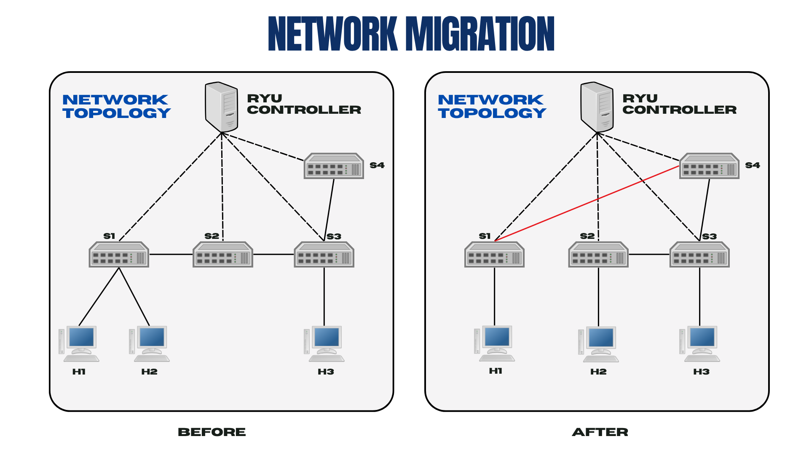
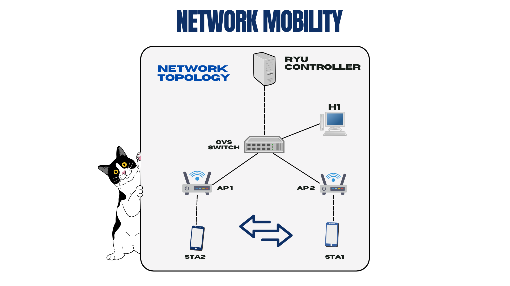

# Seamless Migration & Mobility Network in SDN

## 📜 Project Overview

The **Seamless Migration & Mobility Network** is an academic Software-Defined Networking (SDN) framework designed to maintain uninterrupted network connectivity when devices move or are migrated across the network. This project demonstrates how SDN's centralized control can enable seamless mobility for wireless clients and seamless migration of network resources with minimal packet loss or downtime.

Traditional static networks struggle with dynamic device relocation and often require manual reconfiguration, leading to service interruptions. In this project, an intelligent SDN controller (built with Ryu) integrates dynamic routing algorithms and resource reallocation to automatically re-route traffic during host migrations or wireless handoffs. This approach significantly reduces migration downtime and packet loss while improving throughput and latency compared to conventional methods.

---

## ✨ Key Features

* **Seamless Host/Link Migration (Wired)**: Leverages Mininet to simulate a dynamic wired network migration. The topology initially consists of OpenFlow switches in a chain (S1-S2-S3-S4). When a migration event is triggered (e.g., the link between S1-S2 is removed and a new S1-S4 link is added, while host H2 is relocated), the custom Ryu controller detects these topology changes in real-time and recalculates network paths to maintain communication with minimal interruption.

* **Seamless Mobility Handover (Wireless)**: Utilizes Mininet-WiFi to emulate a wireless mobility scenario. The topology includes a switch, two Wi-Fi Access Points (APs), a wired host, and two mobile stations (STAs). As the STAs move between the coverage areas of the APs, simulating Wi-Fi client roaming, the controller dynamically updates traffic flows to ensure stable connectivity and low latency during AP handovers.

* **Intelligent SDN Controller**: A Ryu-based controller orchestrates both scenarios. It listens for topology events (link up/down, host moved) and uses a shortest-path algorithm to install optimal forwarding rules. It proactively installs rules for ARP and ICMP traffic and employs an ARP-based host discovery mechanism. This intelligent control-plane logic ensures that flows are updated quickly without manual intervention.

---

## 🔧 System Requirements

To set up and run this project, you will need the following environment and software:

* **Operating System**: Ubuntu Linux 20.04 LTS or 22.04 LTS (tested on both).
* **Python**: Python 3.8+ (Python 3.10+ recommended for Ubuntu 22.04).
* **Mininet**: Mininet 2.3 or later, installed with support for OpenFlow 1.3.
* **Mininet-WiFi**: A fork of Mininet that adds wireless simulation capabilities, required for the mobility scenario.
* **Ryu SDN Controller**: The controller framework used for this project.
* **Additional Dependencies**:
    * `matplotlib`: Required for plotting the network graph in the mobility scenario.
    * `xterm`: Required by Mininet/Mininet-WiFi for opening network CLI terminals.
* **Privileges**: Root privileges are needed (`sudo`) to run the simulations.

---

## 🛠️ Installation Guide

Follow these steps to set up the environment on Ubuntu 20.04/22.04:

1.  **Update System and Install Prerequisites**:
    ```bash
    sudo apt update && sudo apt install -y git python3-pip build-essential
    ```

2.  **Install Mininet and Mininet-WiFi**: We will install Mininet-WiFi from source, which also brings in Mininet.
    ```bash
    git clone [https://github.com/intrig-unicamp/mininet-wifi.git](https://github.com/intrig-unicamp/mininet-wifi.git)
    cd mininet-wifi
    sudo util/install.sh -Wlnfv
    ```
    The `-Wlnfv` flags ensure all necessary components (Wireless, wmediumd, Mininet core, OpenFlow, and OVS) are installed.

3.  **Install Ryu SDN Controller**:
    ```bash
    sudo -H pip3 install ryu
    ```
    After installation, confirm with `ryu-manager --version`.

4.  **Download the Project Code**:
    ```bash
    git clone <your-repository-url> seamless-migration-mobility
    cd seamless-migration-mobility
    ```

5.  **Install Additional Python Packages**:
    ```bash
    pip3 install matplotlib
    ```

---

## 📂 Repository Directory Structure

The project is organized into a clean repository structure:

```
seamless-migration-mobility/
├── README.md                 # This documentation file
├── controller/
│   └── ryu.py                # Ryu SDN controller with custom logic
├── mininet/
│   ├── migration.py          # Mininet script for wired migration scenario
│   └── mobility.py           # Mininet-WiFi script for wireless mobility scenario
└── docs/
    ├── Report_Seamless_Mobility_Migration.pdf   # Detailed project report
    ├── screenshots/          # Screenshots and diagrams
```

---

## 🚀 Usage Instructions

To run the project, you will operate two main components: the Ryu SDN controller and one of the Mininet simulation scripts.

### 1. Start the Ryu Controller

Open a new terminal window and run:

```bash
ryu-manager --observe-links controller/ryu.py
```

The `--observe-links` flag is crucial for Ryu's topology discovery module. Leave this controller running while you perform the simulations.

### 2. Run the Wired Migration Simulation

Open a second terminal and run:

```bash
sudo python3 mininet/migration.py
```

Once the network is set up, you will be dropped into the Mininet CLI (`mininet>`). Here, you can use the custom commands to trigger migration events:

* `movesw`: Interrupts the link between S1 and S2 and creates a new link between S1 and S4.
* `moveho`: Migrates host H2 from switch S1 to switch S2.

You can use `pingall` or `h1 ping h2` to verify that connectivity remains seamless after each event.

### 3. Run the Wireless Mobility Simulation

Ensure the Ryu controller is still running. Open a new terminal and execute:

```bash
sudo python3 mininet/mobility.py
```

This script will:
* Initialize the hybrid wired-wireless topology.
* Pop up a Matplotlib window showing a visual layout of the network.
* Automatically move the stations (STA1 and STA2) between APs to trigger handovers.
* Automatically open an `xterm` window to continuously `ping` from h1 to sta2, allowing you to monitor connectivity during the handover.

Observe the ping xterm to confirm that few or no packets are lost as the stations roam.

---

## 💡 Troubleshooting & Tips

* **`pep8` error during Mininet-WiFi installation**: On Ubuntu 22.04+, the installer may fail. Edit the `mininet-wifi/util/install.sh` file and replace all occurrences of `pep8` with `pycodestyle`.
* **Ryu Controller Not Connecting**: Make sure you started `ryu-manager` *before* running the Mininet script. Check that no firewall is blocking port `6633` on localhost.
* **Topology Events Not Detected**: Always run the Ryu controller with the `--observe-links` flag. If you forgot, restart both the controller and the Mininet network.
* **XTerm or Plot Not Showing**: This can happen if you are running on a headless server or over SSH without X forwarding enabled. Either enable X forwarding (`ssh -X`) or edit `mobility.py` to comment out the GUI parts.

---

## 📊 Topology Diagrams

#### Figure 1: Initial Topology for Migration and Topology After Migration Scenario
Four switches (S1-S4) are connected in a chain. This is the starting point where baseline connectivity is verified.
The S1-S2 link has been removed, and a new S1-S4 link is added. Host H2 has also been moved to switch S2. The controller updates flows to maintain connectivity.


#### Figure 2: Topology for Mobility Scenario
A single OpenFlow switch connects to two APs and a wired host. Two wireless stations roam between the APs.

---

## 🎥 Demo Video

Click the thumbnail below to watch a video demonstration of the project in action.

[](https://youtu.be/G_XUkqmKzWY)

---

Thank you for exploring this project! We encourage you to read the report for a deeper dive into the design and to inspect the code for implementation details.
